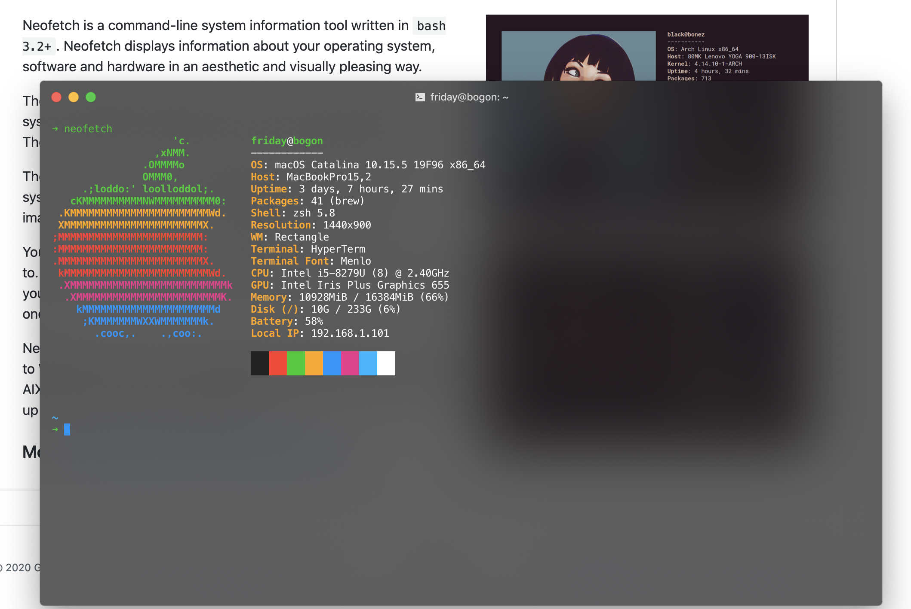

# First Mac
 收录在 macOS 中使用体验绝佳的开源项目，如果你是第一次使用 macOS，那么这些项目一定必不可少！同时欢迎提交 PR 和建议。

## 开发人员

### Homebrew

软件包管理器，完全基于 Git 和 Ruby。使用`brew cask`安装 macOS 应用程序、字体和插件以及其他非开源软件，会将软件包安装到独立目录，并将其文件软链接至 `/usr/local` 。

> 仓库地址：https://github.com/Homebrew
>

安装命令：

```bash
/bin/bash -c "$(curl -fsSL https://raw.githubusercontent.com/Homebrew/install/master/install.sh)"
```

### oh my zsh

让`zsh`复杂的配置降到`0`门槛，完全兼容`bash`。并提供了丰富的可选插件、主题。

> 仓库地址：https://github.com/ohmyzsh/ohmyzsh
>

安装命令：

```bash
sh -c "$(curl -fsSL https://raw.githubusercontent.com/ohmyzsh/ohmyzsh/master/tools/install.sh)"
```

### Powerline Fonts

`Vim statusline` 插件、字体集，支持很多特殊的`icon`字符。

> 仓库地址：https://github.com/powerline/fonts

安装命令：

```bash
# clone
git clone https://github.com/powerline/fonts.git --depth=1
# install
cd fonts
./install.sh
# clean-up a bit
cd ..
rm -rf fonts
```

### Spaceship ZSH

提供了更加丰富的`ZSH`展现形式，并且与`Oh My Zsh`兼容。

> 仓库地址：https://github.com/denysdovhan/spaceship-prompt

安装命令：

```bash
# oh-my-zsh 环境下的安装

# Clone this repo:
git clone https://github.com/denysdovhan/spaceship-prompt.git "$ZSH_CUSTOM/themes/spaceship-prompt"
# Symlink spaceship.zsh-theme to your oh-my-zsh custom themes directory:
ln -s "$ZSH_CUSTOM/themes/spaceship-prompt/spaceship.zsh-theme" "$ZSH_CUSTOM/themes/spaceship.zsh-theme"
# And Set ZSH_THEME="spaceship" in your .zshrc.
```

由于 `Space­ship Prompt` 需要特殊的符号来显示开发环境版本信息，所以需要在终端工具里选择 `Pow­er­line Fonts` 字体 `Meslo LG` 系列中的一个，如 `"Meslo LG M for Powerline”`。

### neofetch

命令行系统信息工具。

> 仓库地址：https://github.com/dylanaraps/neofetch

安装命令：

```bash
# (homebrew)
brew install neofetch
```



## 其他

如果您需要升级您的 macOS 下的`zsh`版本，可按以下命令操作：

```bash
brew install zsh
# add shell path
sudo vim /etc/shells
# add the following line into the very end of the file(/etc/shells)
/usr/local/bin/zsh
# change default shell
chsh -s /usr/local/bin/zsh
# then you should to restart your computer
```

终端代理 `Alias`分享：

```bash
alias ss_proxy='export all_proxy=socks5://127.0.0.1:1086'
alias v2ray_proxy='export all_proxy=socks5://127.0.0.1:1081'
alias clashx_proxy='export https_proxy=http://127.0.0.1:7890 http_proxy=http://127.0.0.1:7890 all_proxy=socks5://127.0.0.1:7891'
alias un_proxy='unset all_proxy https_proxy http_proxy'
```

---
